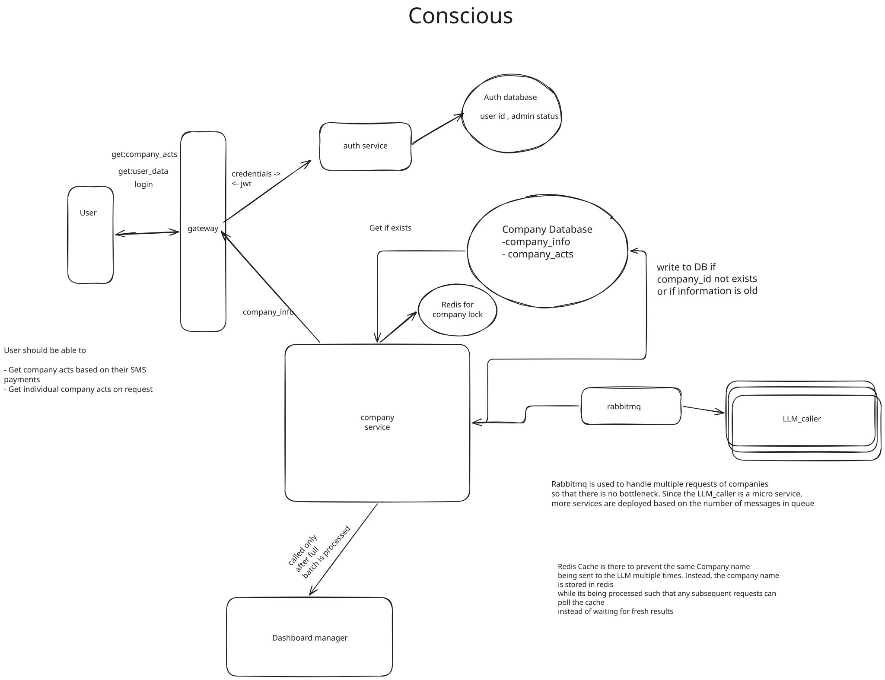

# Conscious

> **You spend money. Companies commit crimes. Conscious connects the two.**

Conscious parses your bank SMS alerts, extracts the merchant, and tells you exactly what ethical violations, environmental crimes, and human rights abuses that company has been found guilty of — sourced live from the web via an LLM agent.

---

## What It Does

1. You send a bank SMS (ICICI / HDFC) to the API
2. The system extracts the merchant name using regex
3. Checks the database — if the company is known, results come back instantly
4. If unknown, fires up an LLM agent (GPT-4o + Tavily web search) to research the company
5. The agent finds up to 5 major atrocities (climate, human rights, labor) with severity ratings
6. Results are persisted and returned to you

---

## Architecture



---

## Data Flow (Step by Step)

### 1 — SMS Ingestion & Parsing

`POST /company_acts` on the Gateway validates the JWT, then forwards the raw SMS string + user email to the Company Service.

### 2 — Cache Check

Before any async work, the Company Service checks PostgreSQL for the merchant. If acts exist → return immediately.

### 3 — RabbitMQ: Dispatching to LLM

If the company is **not** in the database:

```
Company Service
  → SET  processing:<company>   (Redis, TTL 120s)   # dedup lock
  → PUBLISH {company_name, email_id}
           → company_data_queue  (RabbitMQ)
  → enters poll loop
```

The dedup lock ensures that even if multiple requests arrive for the same unknown company simultaneously, only **one** LLM call is made. Every subsequent request just waits on the Redis result key.

### 4 — Redis Polling (the async bridge)

The Company Service's HTTP handler does **not** use async/await or callbacks. It actively polls Redis:

```python
# company_processor.py
deadline = time.time() + POLL_TIMEOUT          # 30 seconds
while time.time() < deadline:
    result = redis_client.get(f"result:{company_name}")
    if result:
        return json.loads(result), 200
    time.sleep(0.5)                             # 0.5s interval
raise HTTPException(status_code=504, detail="Timed out")
```

This keeps the HTTP connection alive, holding it open as a synchronous long-poll until the LLM result is ready or the 30s deadline is hit.

### 5 — LLM Agent (LangGraph + GPT-4o + Tavily)

The LLM Client consumes `company_data_queue` and builds a LangGraph agent per message:

```
Agent Graph:
  START → __invoke_model → (tool call?) → ToolNode[Tavily] → __invoke_model → END
```

The agent is given a strict system prompt: return **only** raw JSON, no markdown, no prose. The expected schema:

```json
{
  "company_name": "Nestlé",
  "atrocities": [
    {
      "title": "Child Labor in Cocoa Supply Chain",
      "severity": "high",
      "summary": "...",
      "link": "https://..."
    }
  ]
}
```

Severity is mapped to integers on write: `low → 1`, `medium → 2`, `high → 3`.

### 6 — RabbitMQ: Result Return Path

After the LLM agent finishes, `llm_caller.py` publishes the JSON result to `company_acts_queue`:

```
LLM Client → company_acts_queue (RabbitMQ) → Company Service consumer
```

The Company Service runs a **daemon thread** (`company_acts_consumer.py`) that:
1. Consumes `company_acts_queue`
2. Writes `company_info` + `company_acts` rows to PostgreSQL
3. Sets `result:<company>` in Redis with a 60s TTL → **releases the poll loop above**
4. `basic_ack` on success, `basic_nack` on failure (message requeued)

### 7 — Response

The poll loop unblocks, reads the JSON from Redis, and the HTTP response travels back up through Gateway to the user.

---

## Services

| Service | Port | Responsibility |
|---------|------|---------------|
| Gateway | 8080 | Auth, routing, JWT validation |
| Auth Service | 8000 | Register, login, JWT issue/validate |
| Company Service | 8085 | SMS parse, DB lookup, RMQ publish, Redis poll |
| LLM Client | — | RMQ consumer, LangGraph agent, result publisher |
| RabbitMQ | 5672 / 15672 | Message broker (two queues) |
| Redis | 6379 | Dedup lock + async result channel |
| PostgreSQL (auth) | 5432 | Users |
| PostgreSQL (company) | 5432 | Company info + acts |

---

## API Reference

### Auth

```bash
# Register
curl -X POST http://localhost:8080/login \
  -H "Content-Type: application/json" \
  -d '{"email": "you@example.com", "password": "secret"}'
```

### Submit SMS

```bash
curl -X POST http://localhost:8080/company_acts \
  -H "Content-Type: application/json" \
  -H "Authorization: Bearer <jwt>" \
  -d '{"sms": "INR 500.00 debited on 01-Apr-26 on AMAZON."}'
```

**Response:**
```json
[
  {
    "id": 1,
    "company_id": 42,
    "act_severity": 3,
    "act_title": "Anti-competitive practices in cloud services",
    "act_description": "..."
  }
]
```

### Look Up a Company Directly

```bash
curl "http://localhost:8080/get_company_info?company_name=Amazon"
```

---

## Redis Key Design

| Key | Purpose | TTL |
|-----|---------|-----|
| `processing:<company>` | Dedup lock — prevents duplicate LLM calls | 120s |
| `result:<company>` | LLM payload, released to waiting HTTP poll | 60s |

---

## RabbitMQ Queue Design

| Queue | Producer | Consumer | Payload |
|-------|---------|---------|---------|
| `company_data_queue` | Company Service | LLM Client | `{company_name, email_id}` |
| `company_acts_queue` | LLM Client | Company Service daemon | Full atrocities JSON |

Both queues use `delivery_mode=PERSISTENT` — messages survive broker restarts.

---

## Database Schema

### `conscious_auth`
```
users (id, name, email, password_hash)
```

### `conscious_content`
```
company_info (id, company_name)
company_acts (id, company_id, act_severity [1-3], act_title, act_description)
```

---

## Environment Variables

| Service | Variable | Value |
|---------|---------|-------|
| Auth | `DATABASE_SERVER` | `host:port/conscious_auth` |
| Auth | `SECRET_KEY` | JWT signing secret |
| Gateway | `AUTH_SERVER_URL` | `http://auth:8000` |
| Gateway | `COMPANY_INFO_SVC_URL` | `http://company:8085` |
| Company | `DATABASE_SERVER` | `host:port/conscious_content` |
| Company | `REDIS_URL` | `redis://redis:6379` |
| LLM Client | `OPENAI_API_KEY` | GPT-4o key |
| LLM Client | `TAVILY_API_KEY` | Tavily search key |
| LLM Client | `COMPANY_NAME_QUEUE` | `company_data_queue` |
| LLM Client | `COMPANY_ACTS_QUEUE` | `company_acts_queue` |

---

## Running Locally (Kubernetes)

```bash
# From python/src/
kubectl apply -f rabbit/manifests/
kubectl apply -f redis/manifests/
kubectl apply -f auth/manifests/
kubectl apply -f company_service/manifests/
kubectl apply -f llm_client/manifests/
kubectl apply -f gateway/manifests/
```

Monitor RabbitMQ queues at `http://localhost:15672` (default: `guest`/`guest`).

---

## Roadmap

- [ ] **Phase 5** — Extract spend amount from SMS; persist `user_spends` table
- [ ] **Phase 6** — Dashboard Manager service: aggregate a user's full spending history mapped to company crimes
- [ ] **Phase 6** — User Data store: per-user companies, amounts, historical summaries
